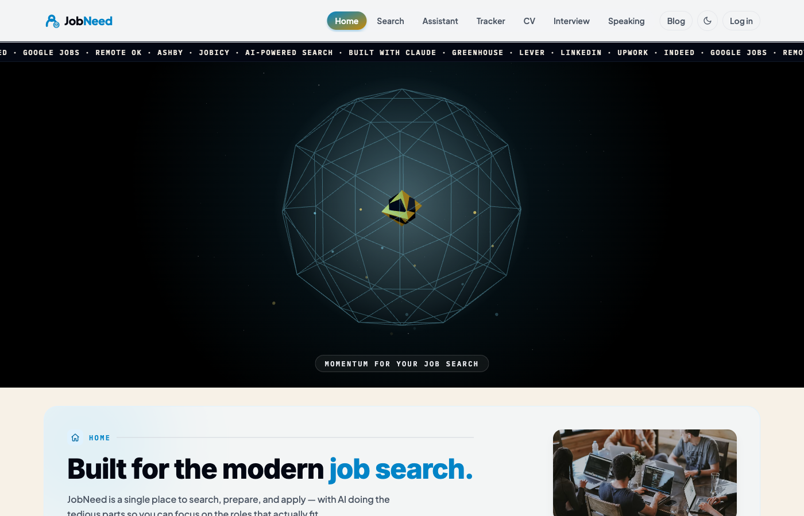
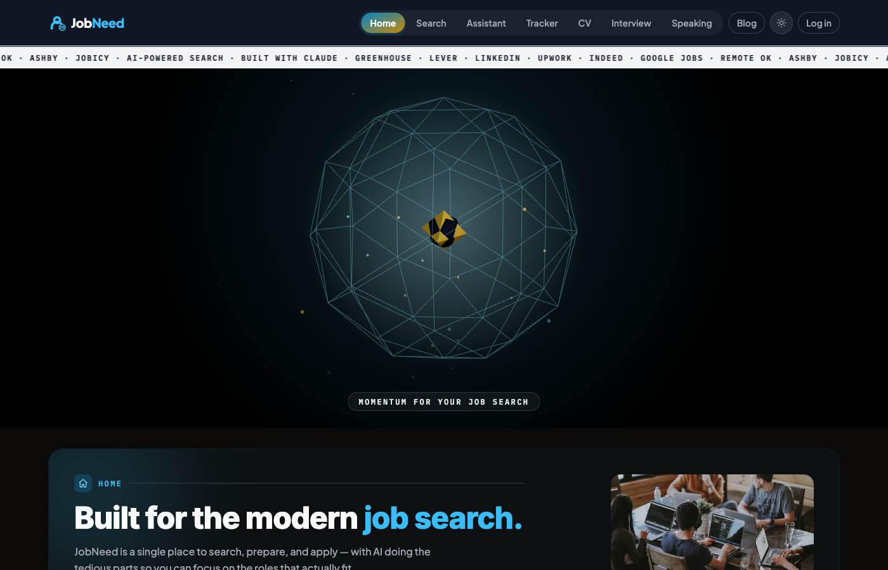
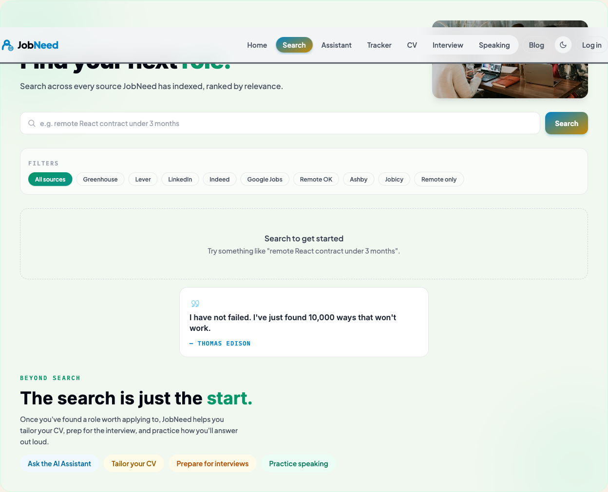
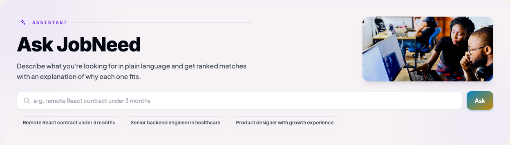
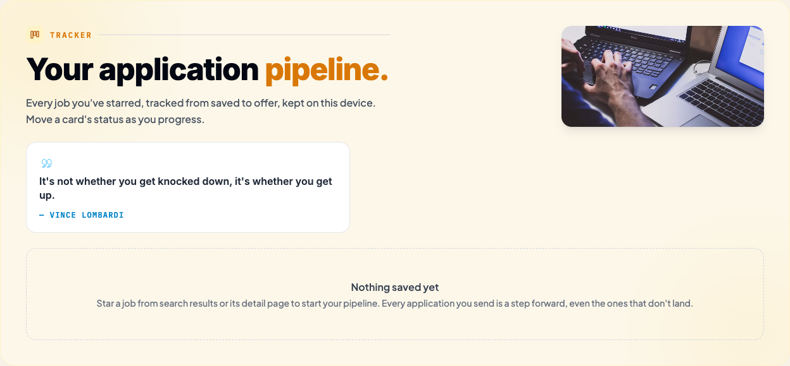
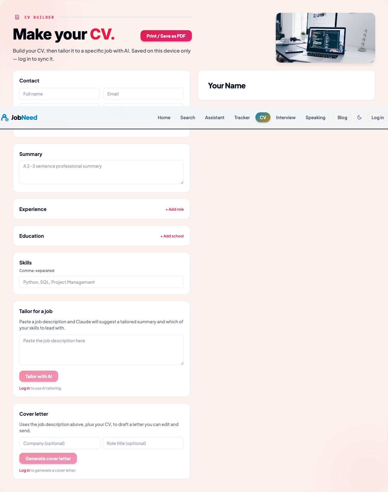
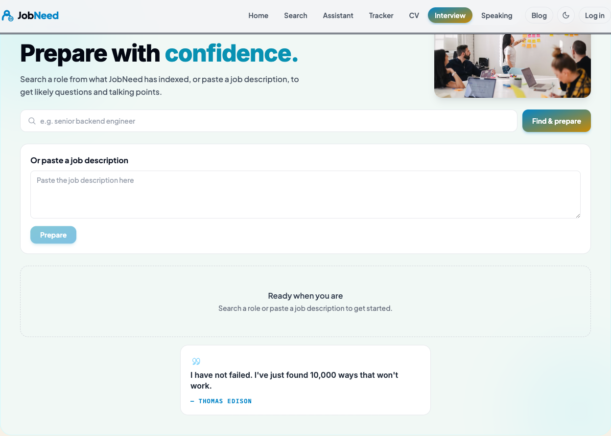
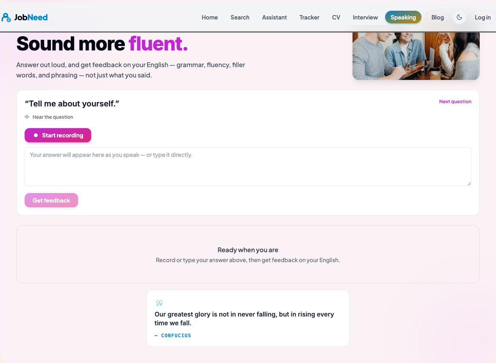
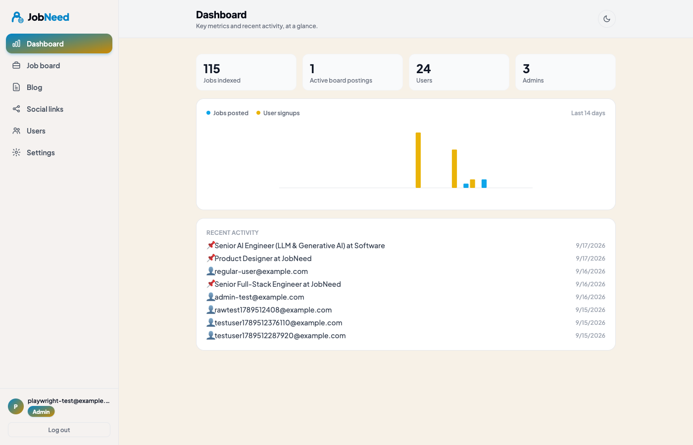
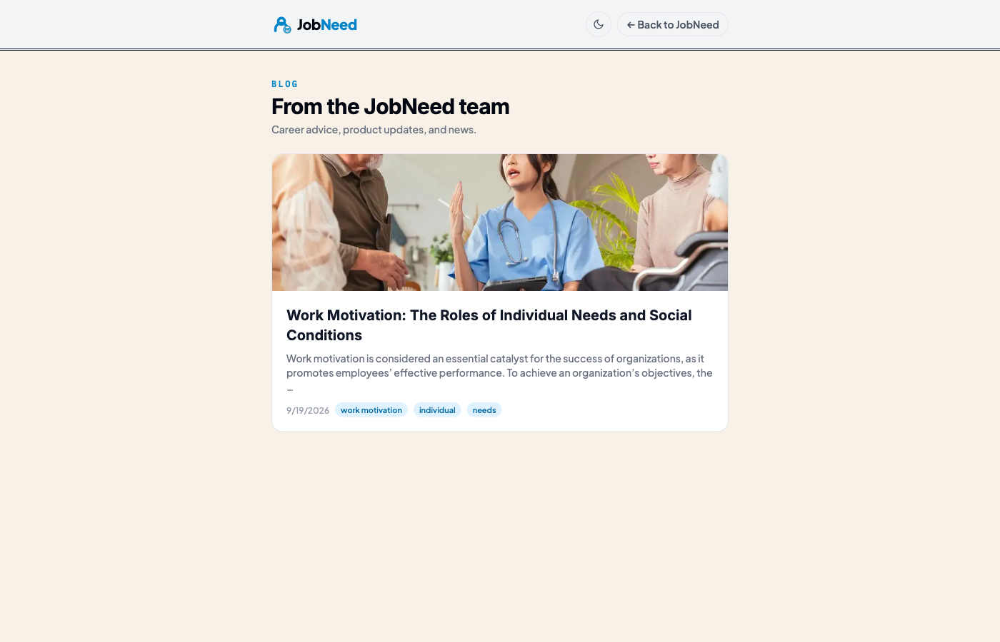

# JobNeed

A full-stack, RAG-based AI career platform. It ingests job postings from nine
sources, embeds and indexes them, and lets you search or chat in plain
language ("find me remote React contracts under 3 months") to get relevant,
ranked matches with an LLM-generated explanation of *why* each one fits.
Beyond search, it tailors your CV and cover letters to a specific posting,
generates interview questions from the real job description, and gives you
feedback on your spoken answers — all in one scrolling, single-page app.

## Screenshots

| | |
|---|---|
|  |  |
|  |  |
|  |  |
|  |  |
|  |  |

Each one-page section (Home, Search, Assistant, Tracker, CV, Interview,
Speaking) has its own accent color, icon, and tinted background panel, so
they read as distinct screens while scrolling one continuous page — see
[Architecture](#architecture).

## Features

- **Search across 9 sources at once** — Greenhouse, Lever, Ashby, Remote OK,
  Jobicy, Google Jobs, plus schema.org `JobPosting` crawling and single-URL
  import for LinkedIn/Indeed/Upwork listings — ranked by relevance via
  retrieval-augmented search, not just keyword matching. Filter by source or
  remote-only.
- **AI Assistant** — describe what you want in plain language and get ranked
  matches with an explanation of why each one fits, in a chat interface.
- **CV Builder** — build a CV, tailor its emphasis to a specific job
  description with AI, and generate a matching cover letter. Print or save
  as PDF.
- **Interview Prep** — pulls a real indexed posting (or a pasted job
  description) and generates likely interview questions, categorized by
  type, with model talking points.
- **Speaking Practice** — answer interview questions out loud via your
  microphone and get AI feedback on grammar, fluency, filler words, and
  phrasing, not just a transcript.
- **Application Tracker** — a Kanban-style pipeline (Saved → Applied →
  Interviewing → Offer/Rejected) for every job you've starred, synced to
  your account when logged in or kept on-device otherwise.
- **Accounts** — email/password auth with rate-limited, cost-controlled
  AI endpoints; connect your LinkedIn/Indeed/Upwork/GitHub profiles to
  personalize search and sharpen cover letters.
- **Admin panel** — a fully decoupled back office at **`/admin`** for
  running the site: post job-board listings, write blog posts, manage
  social links, view a metrics dashboard, and manage admin/user accounts
  with role-based access and two-factor auth. See [Admin panel](#admin-panel)
  below.
- **Blog** — posts written from the admin panel appear at **`/blog`**,
  with Markdown-lite formatting (headings, bold, links, lists), a featured
  image, and tags. Draft, schedule, or publish immediately.

The whole app lives on one URL with a sticky, scroll-spy nav — no page
reloads between sections, and job details open in a modal rather than a
separate route.

## Data sources: a compliance note

Indeed, LinkedIn, and Facebook all prohibit automated scraping of their sites
in their Terms of Service, and LinkedIn/Meta have pursued legal action against
scrapers (e.g. *hiQ Labs v. LinkedIn*). Because of that, this project does
**not** ship working HTML scrapers for those sites. Instead, `backend/app/scrapers/`
defines a common `JobSource` interface with adapters that pull from
compliant channels:

| Source            | Recommended path                                                        | Status |
|-------------------|--------------------------------------------------------------------------|--------|
| Greenhouse        | [Public job-board API](https://developers.greenhouse.io/job-board.html) — no key needed | **Working** |
| Lever             | [Public postings API](https://github.com/lever/postings-api) — no key needed | **Working** |
| Ashby             | [Public Job Board API](https://developers.ashbyhq.com/) — no key needed, meant for embedding a company's postings elsewhere | **Working** |
| Remote OK         | [Public JSON feed](https://remoteok.com/api) of remote listings — no key needed | **Working** |
| Jobicy            | [Public remote-jobs API](https://jobicy.com/api/v2/remote-jobs) — no key needed | **Working** |
| JobPosting schema | [schema.org JobPosting](https://developers.google.com/search/docs/appearance/structured-data/job-posting) crawl of career pages — no key needed | **Working** |
| URL import        | Paste one job URL (e.g. a LinkedIn or Indeed listing); reads its public Open Graph preview tags — no key, no bulk scraping | **Working** |
| Google            | SerpApi's [Google Jobs API](https://serpapi.com/google-jobs-api) (needs `SERPAPI_API_KEY`) | **Working**, needs a key |
| Indeed (bulk)     | [Indeed Publisher/XML feed](https://www.indeed.com/publisher) or a licensed aggregator API | Stubbed — needs publisher access |
| LinkedIn (bulk)   | [LinkedIn Talent/Jobs API](https://learn.microsoft.com/en-us/linkedin/talent/job-postings/) (partner access) or Proxycurl (licensed) | Stubbed — needs partner access |

Greenhouse, Lever, and Ashby all run the same kind of public, unauthenticated
feed a company uses to power its own careers page — pulling from it isn't a
ToS violation the way scraping Indeed or LinkedIn would be, and it needs no
partner agreement. Configure which companies to pull via `GREENHOUSE_BOARDS`
/ `LEVER_BOARDS` / `ASHBY_BOARDS` in `.env` (comma-separated board tokens,
found in the URL of a company's careers page).

Remote OK and Jobicy are global feeds purpose-built for third-party
consumption — no per-company configuration needed. Remote-only boards like
these often report a plain city/country name in their location field even
though every listing is remote by definition; a shared `normalize_remote_location`
helper folds that into something the app's remote-job filter still matches.

The **JobPosting schema** source crawls a configured list of career-page
URLs (`JOBPOSTING_URLS` in `.env`) for `<script type="application/ld+json">`
blocks with `@type: JobPosting` — the same structured data companies publish
specifically so Google for Jobs can index them, so reading it is squarely
within its intended purpose.

**URL import** (`POST /api/jobs/import-url` with `{"url": "..."}`, auth
required) fetches one user-supplied posting URL and reads its Open Graph
preview tags (`og:title`, `og:description`) — the same metadata the site
publishes for link-preview cards. For LinkedIn specifically it also parses
the "`Company` hiring `Title` in `Location`" pattern LinkedIn's `og:title`
follows. A single explicit URL a user pastes is a very different risk
profile from bulk-scraping a site's listings, so this works for LinkedIn
without needing partner access — it just can't *search* LinkedIn, only
import a URL you already have. The fetch validates the URL and every
redirect hop against private/loopback/link-local addresses before
requesting it, to close off SSRF via a malicious or redirecting URL.

Indeed and LinkedIn's bulk/search APIs remain stubbed with a
`NotImplementedError` pointing at the docs above, since those genuinely
require an approved account, not just code. There's also a `sample.py`
adapter with local fixtures, so the rest of the pipeline (ingestion →
embeddings → vector search → RAG chat) is runnable without any live
source at all.

Every real posting also passes through `app/rag/enrich.py`, which uses
Claude to condense verbose descriptions (real postings are often padded
with repeated company boilerplate) into a focused summary — it only fires
for long descriptions, and falls back to the original text if no
`ANTHROPIC_API_KEY` is set or the call fails, so ingestion is never blocked
by it.

Trigger an ingest with `POST /api/jobs/ingest/{source}` where `{source}` is
`sample`, `greenhouse`, `lever`, `ashby`, `remoteok`, `jobicy`,
`jobposting_schema`, or `google_jobs`, with an optional `?query=` to filter
by title/description. Import a single posting with `POST /api/jobs/import-url`.

## Admin panel

JobNeed's back office lives at its own route, **`/admin`** — a genuinely
separate page (the one spot in the app that isn't a section of the
one-pager, alongside `/blog`), reachable via a low-key link in the footer
or main nav. It skips the marketing hero, marquee, and 3D scene entirely,
since an admin's job there is narrow. The session persists across reloads
via its own token, independent of whether a regular user is logged in on
the same device or browser tab.

### Decoupled from regular user accounts

The admin panel is deliberately **decoupled from regular user accounts**:
its own `admin_accounts` table, its own login (`POST /api/auth/admin-login`),
its own passwords. An admin's access never depends on (or shares a password
with) any job-seeker account that happens to use the same email — this was
a deliberate design decision, not an oversight, even though it means more
plumbing than a single unified login.

`ADMIN_EMAILS` (comma-separated) and `ADMIN_PASSWORD` in `.env` only *seed*
the first admin row(s) on startup — from then on the database is the
source of truth, managed entirely from the panel itself.

### Account management

- **Multiple admins**, each with a **role** — `admin` (full access,
  including managing other admins/roles and regular user accounts) or
  `editor` (job board, blog, social links, and the dashboard, but not
  account/user management). New admins default to `editor`; granting full
  `admin` is an explicit choice. The last remaining `admin`-role account
  can't be removed or demoted, so you can't lock yourself out.
- **Change your own password** at any time, independent of `.env`.
- **Two-factor authentication** — enable TOTP (Google Authenticator, Authy,
  1Password, etc.) with a scannable QR code; login then becomes a two-step
  flow (password, then a 6-digit code) using a short-lived pending token
  that's cryptographically distinct from a full session token, so it can't
  be used to skip the second step.

### Dashboard

An at-a-glance view of the system — total jobs indexed, active board
postings, users, and admins, a 14-day chart of jobs posted vs. user
signups, and a merged recent-activity feed. Read-only, so both roles can
see it.

### Data management (CRUD)

- **Job board** — post original listings directly on JobNeed. A posting
  goes through the exact same path as a scraped one
  (`services/ingestion.py`'s `ingest_one`) — stored as `source: "jobneed"`
  and embedded into the same vector index — so it's searchable and shows
  up in the AI Assistant immediately, ranked the same way as everything
  else. Closing a posting removes it from the vector index right away
  (`rag/vector_store.delete_job`) so it stops surfacing in search, while
  the row itself stays in the database for your own records.
- **Blog posts** — write, schedule, and publish posts for the public
  `/blog` page. Content supports lightweight Markdown (headings via the
  H1/H2/H3 toolbar, bold, italic, links, lists); a post can carry a
  featured image (paste a URL or upload a file — stored under
  `backend/uploads/blog/`, served at `/uploads/blog/...`) and
  comma-separated tags. An admin-panel content calendar shows posts by
  scheduled date. A post is only visible on `/blog` once it's marked
  published *and* its scheduled time (if any) has passed.
- **Social links** — manage the social media accounts JobNeed links out to.
- **Users** — view and remove regular job-seeker accounts (`admin` role
  only). Removing a user also clears their saved jobs and CV record.

### Endpoints

Auth: `POST /api/auth/admin-login` (password step; returns either a
session token or, if 2FA is on, a short-lived `pending_token`),
`POST /api/auth/admin-login/totp` (second step), `GET/POST /api/auth/admin-accounts`
+ `DELETE /api/auth/admin-accounts/{email}` + `PATCH /api/auth/admin-accounts/{email}/role`
(manage admins and roles — `admin` role only), `POST /api/auth/admin-password`,
`POST /api/auth/admin-totp/setup|confirm|disable`, `GET /api/auth/admin-dashboard`,
`GET /api/auth/users` + `DELETE /api/auth/users/{id}` (`admin` role only).

Job board: `POST /api/jobs/board` (create), `PATCH /api/jobs/board/{id}`
(edit), `POST /api/jobs/board/{id}/close`, `GET /api/jobs/board/mine`.

Content: `GET/POST /api/admin/posts` + `PATCH/DELETE /api/admin/posts/{id}`,
`POST /api/admin/posts/upload-image`, `GET/POST /api/admin/social-links` +
`PATCH/DELETE /api/admin/social-links/{id}`, `GET /api/admin/dashboard/chart-data`.
Public, unauthenticated reads: `GET /api/blog/posts`, `GET /api/blog/posts/{id}`.

Every admin-panel endpoint (bar the two login steps and the public blog
reads) requires a valid admin session token — 401 with none/invalid, 403 if
the account behind a *valid* token was since deleted or lacks the required
role — and job-board writes are scoped to `source == "jobneed"` so they
can't touch a scraped posting.

## Security notes

- **Auth required on AI endpoints.** `/cv/tailor`, `/cv/cover-letter`, and
  `/api/jobs/import-url` all require a logged-in user and are rate-limited
  (10/minute) so a single Claude-backed endpoint can't be hammered for free
  or run up API costs anonymously.
- **Password strength enforced** server-side (minimum 8 characters) on
  signup; login itself is left unconstrained so pre-existing accounts never
  get locked out.
- **SSRF-hardened URL import** — `app/core/url_safety.py` validates scheme
  and resolved IP (rejecting private/loopback/link-local/reserved ranges)
  on the initial URL and on every redirect hop, rather than trusting
  `httpx`'s automatic redirect handling.

## Architecture

```
scrapers/*  →  services/ingestion.py  →  Postgres (raw jobs)
                                       →  rag/embeddings.py → vector_store.py (Chroma)

Frontend (React, one page) → /api/search, /api/chat → rag/retriever.py + rag/chat.py (Claude)
```

- **Backend**: FastAPI, SQLAlchemy + Postgres for structured job data, Chroma
  for the vector index, Anthropic's Claude for RAG answers, summarization,
  CV tailoring, interview prep, and speaking feedback.
- **Frontend**: React + Vite + TypeScript + Tailwind. Almost the whole app
  is one scrolling page with a sticky scroll-spy nav and a Three.js hero
  visual; `/admin`, `/account`, `/blog`, and `/blog/:id` are the real
  routes, kept separate via a minimal `react-router-dom` setup. Each
  one-page section (Home, Search, Assistant, Tracker, CV, Interview,
  Speaking) gets its own accent color, icon, and tinted background panel
  (`lib/theme.ts`, `components/SectionShell.tsx`) so they read as distinct
  screens rather than one undifferentiated column, even though it's still a
  single continuous page.

## Getting started

### Backend
Requires Python ≤3.12 — `chromadb`'s `onnxruntime` dependency doesn't yet
ship wheels for newer versions. (The Docker image already pins 3.12, so
`docker compose up` is unaffected regardless of your local Python.)
```bash
cd backend
cp .env.example .env   # fill in ANTHROPIC_API_KEY, DB settings, and ADMIN_EMAILS/ADMIN_PASSWORD
python3.12 -m venv .venv && source .venv/bin/activate
pip install -r requirements.txt
uvicorn app.main:app --reload
```

### Frontend
```bash
cd frontend
npm install
npm run dev
```

### Everything via Docker
```bash
docker compose up --build
```

## Project layout

```
backend/
  app/
    core/        # config, db session, JWT auth, URL safety (SSRF guard), rate limiting
    models/      # SQLAlchemy models (incl. AdminAccount, BlogPost, SocialLink)
    schemas/     # Pydantic schemas
    api/routes/  # FastAPI routers (jobs, search, chat, cv, interview, speaking, auth, admin_content, blog)
    scrapers/    # JobSource interface + per-site adapters
    rag/         # embeddings, vector store, retriever, chat, enrichment
    services/    # ingestion pipeline tying scrapers → db → vector store
  uploads/blog/  # admin-uploaded blog images, served at /uploads/blog/... (gitignored)
frontend/
  src/
    api/         # typed fetch client
    components/  # JobCard, SearchBar, ChatPanel, JobDetailModal, MotivationScene3D, Layout,
                 # JobBoardAdmin, AdminAccountSettings, AdminDashboard, AdminPosts, AdminSocialLinks, AdminUsersPanel
    context/     # auth, saved-jobs, job-modal, toast providers shared across sections
    pages/       # OnePage (composes every section) + one component per feature section;
                 # AdminPage, Blog, and BlogPostPage are the separate routes
```
